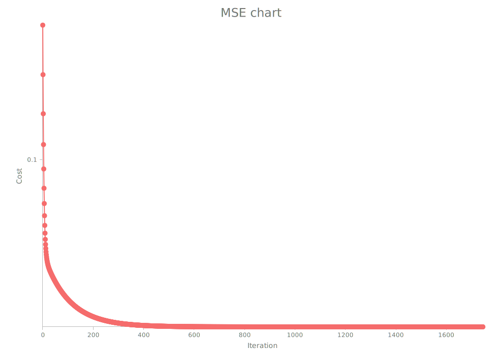
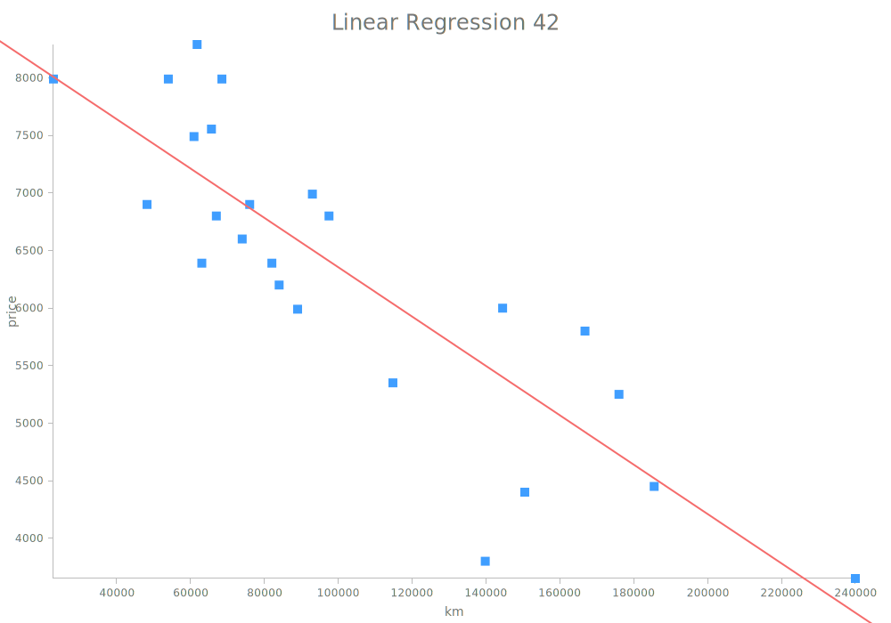

# Linear Regression

#### Goals:
* Pour ce projet vous devrez créer un programme qui predit le prix d une voiture en utilisant l’entrainement par fonction linéaire avec un algorithme du gradient.
* Toute fonction que ferait le travail à votre place est interdie (predict, calcul de thetas, ...), vous devrez tout recoder vous même.

Regarder [subject.pdf](fr.subject.pdf) pour plus d'informations.

## Requirements:
* `rust`
* `cargo`

## Setup:
```
git clone https://github.com/LudovicLemaire/42-linear-regression.git
cd 42-linear-regression
cargo build
```

## Show datas:
```
cargo run --bin show < ./data/SacramentocrimeJanuary2006.csv
```
|Show datas on a graph                                                |
|---------------------------------------------------------------------|
|                                 |
|That is all Sacramento crimes in January 2006, with position long/lat|


## Training phase:
```
cargo run --bin train < ./data/data.csv
```
|Learning curve                                          |Training curve                                          |MSE                               |
|--------------------------------------------------------|--------------------------------------------------------|----------------------------------|
||||


## Predict phase:
```
cargo run --bin predict
```
|Linear Regression                                       |
|--------------------------------------------------------|
|                    |
